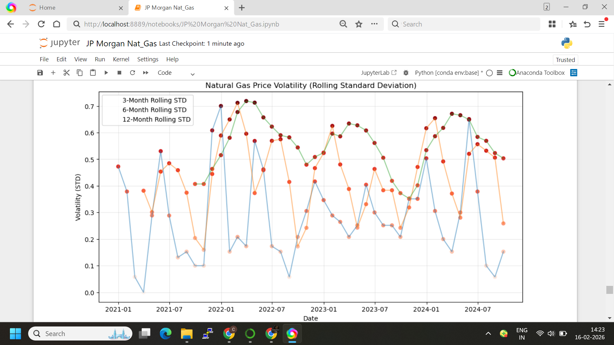
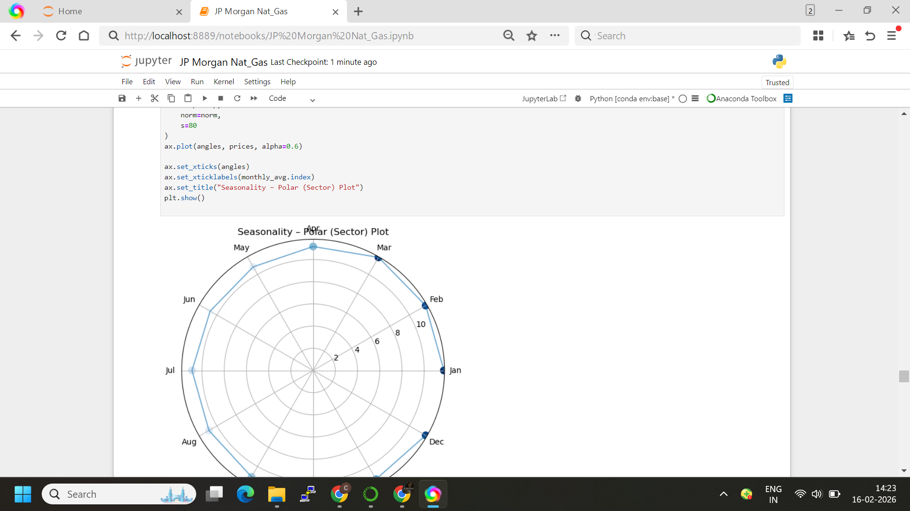
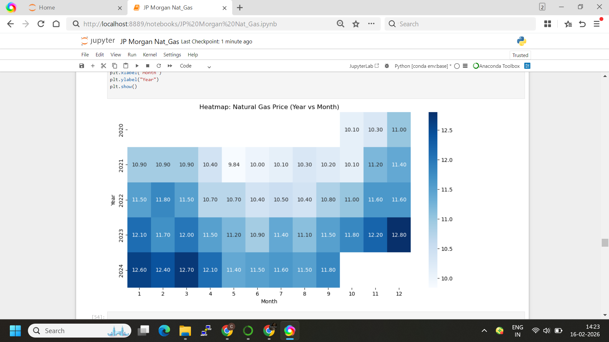
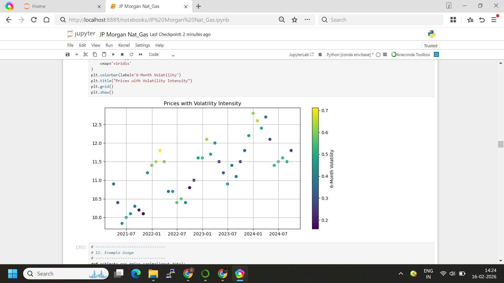

# Natural Gas Price Analysis & Forecasting (JP Morgan Case Study)

This project presents a **complete end-to-end analytics pipeline** for Natural Gas price data, including:
- Data cleaning & feature engineering
- Seasonality & trend analysis
- Volatility & rolling risk analysis
- SARIMA-based forecasting
- Backtesting with RMSE
- Visualization-ready outputs for Power BI / Tableau

---

## 📁 Project Structure

```
JP_Morgan_Nat_Gas/
│
├── data/
│   └── Nat_Gas.csv
│
├── notebooks/
│   └── JP_Morgan_Nat_Gas.ipynb
│
├── src/
│   └── natural_gas_price_analysis_submission.py
│
├── images/
│   ├── volatility_plot.png
│   ├── polar_seasonality.png
│   ├── heatmap_year_month.png
│   ├── price_vs_volatility.png
│
├── requirements.txt
└── README.md
```

---

## 📊 Key Visual Outputs

### 1️⃣ Volatility – Rolling Standard Deviation


### 2️⃣ Seasonality – Polar (Sector) Plot


### 3️⃣ Heatmap – Year vs Month


### 4️⃣ Prices with Volatility Intensity


---

## 🔬 Analytics Covered

- **Price Trend Analysis**
- **Monthly Seasonality**
- **H1 vs H2 Split**
- **Rolling Volatility (3M, 6M, 12M)**
- **SARIMA Forecasting (12 Months)**
- **Backtesting & RMSE**
- **Price Estimation Function (Past + Future)**

---

## 🧠 Model Used

- **SARIMA (Seasonal ARIMA)**
  - Captures trend, seasonality, and autocorrelation
  - Industry-standard for commodity time-series forecasting

---

## ▶️ How to Run

```bash
pip install -r requirements.txt
```

```bash
python src/natural_gas_price_analysis_submission.py
```

Or open and run:
```
notebooks/JP_Morgan_Nat_Gas.ipynb
```

---

## 📦 Input Data

- **File:** `Nat_Gas.csv`
- **Frequency:** Monthly
- **Columns:**
  - `Dates`
  - `Prices`

---

## 📈 Output

- Forecasted prices (next 12 months)
- RMSE score for backtesting
- Multiple analytics-ready visualizations
- Dashboard-ready logic for Power BI / Tableau

---

## 🧑‍💼 Use Case Fit

✔ Quantitative Research  
✔ Risk & Volatility Analysis  
✔ Energy / Commodity Analytics  
✔ JPMorgan-style Data Science Case Study  

---

## 📌 Author

Prepared as part of a **JP Morgan Quant / Data Analytics Program** submission.
Written by **Jagadamba** task complete
